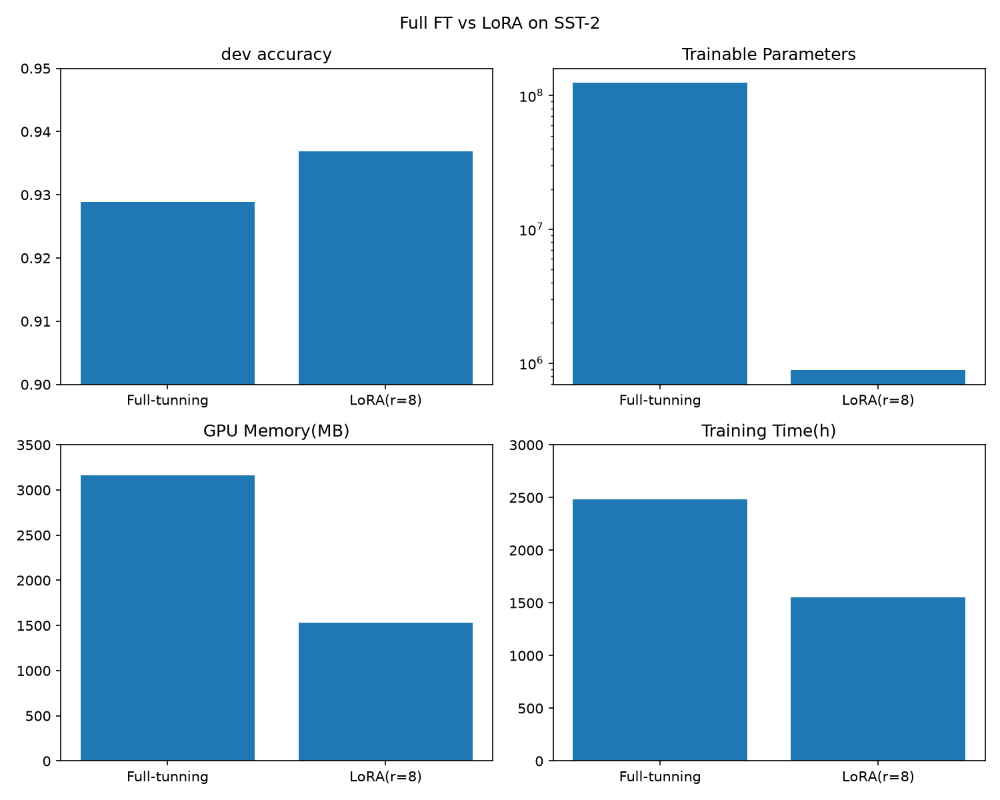
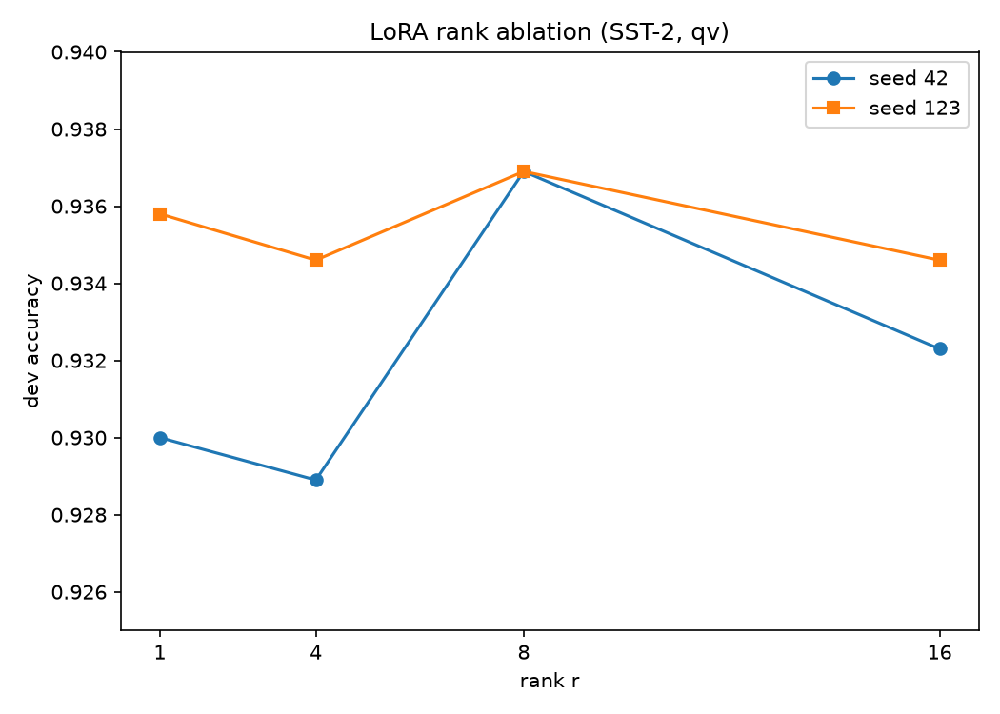
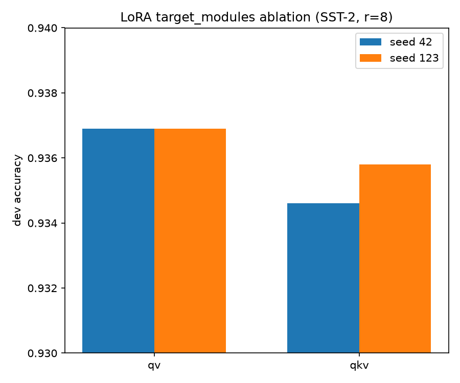

# LoRA 论文复现（SST-2 / RoBERTa-base）

复现论文 **LoRA: Low-Rank Adaptation of Large Language Models**（arXiv:2106.09685）的核心方法，并在 SST-2 情感分类上对比 **全量微调（Full Fine-tuning）** 与 **LoRA**，完成 rank 与 target_modules 两组消融实验。

## 一句话结论

LoRA（r=8，只加在 Q/V）用 **约 1/140 的可训练参数**、**约 1/2 的显存**，在 SST-2 上达到 **0.9369** dev accuracy，持平并略高于 Full FT 的 0.9289；rank 消融呈倒 U，target 消融显示只加 Q/V 已足够。

## 核心结果

| 方法 | dev accuracy | 可训练参数 | 显存峰值 | 训练时间 |
|---|---|---|---|---|
| Full FT | 0.9289 | 124,647,170 | 3164 MB | 2480 s |
| **LoRA（r=8, qv）** | **0.9369** | **887,042** | **1529 MB** | **1551 s** |







完整分析见 [docs/报告.md](docs/报告.md)，复习提纲见 [docs/知识点.md](docs/知识点.md)，逐步记录见 [docs/实验日志.md](docs/实验日志.md)。

## 环境

- Windows 11 + RTX 4060（8GB）+ CUDA
- Python 3.x + PyTorch（CUDA 版）+ transformers + peft + datasets + pandas + matplotlib

## 快速复现

```bash
# ① Full FT baseline
./.venv/Scripts/python.exe train/train_full_ft.py

# ② LoRA（r=8, qv）
./.venv/Scripts/python.exe train/train_lora_ablation.py --r 8 --target qv

# ③ rank 消融（r=1/4/8/16，每个跑 2 个种子）
./.venv/Scripts/python.exe train/train_lora_ablation.py --r 1  --target qv --seed 42
./.venv/Scripts/python.exe train/train_lora_ablation.py --r 1  --target qv --seed 123
# ... r=4 / 8 / 16 同理

# ④ target_modules 消融（r=8）
./.venv/Scripts/python.exe train/train_lora_ablation.py --r 8 --target qkv --seed 42
./.venv/Scripts/python.exe train/train_lora_ablation.py --r 8 --target qkv --seed 123

# ⑤ 画图
./.venv/Scripts/python.exe plot/plot_2.py   # Full FT vs LoRA
./.venv/Scripts/python.exe plot/plot_3.py   # rank 消融
./.venv/Scripts/python.exe plot/plot_4.py   # target 消融
```

训练脚本支持 `--r`（rank）、`--target`（qv / qkv）、`--seed`（随机种子）三个命令行参数。

## 项目结构

```
├── data/                  # SST-2 数据
├── models/roberta-base/   # 本地 RoBERTa-base 权重
├── train/                 # 训练脚本（Full FT / LoRA / LoRA 消融）
├── plot/                  # 画图脚本 + 生成的图
├── logs/                  # 各次运行的完整日志
└── docs/                  # 执行计划 / 实验日志 / 知识点 / 报告
```

## 关键说明

- **论文原始结果 vs 我们的结果**：论文报 RoBERTa-base + LoRA 在 SST-2 dev 约 95.1；我们得到 0.9369。差异来源（种子、超参、epoch、实现版本等）详见 [docs/报告.md §5](docs/报告.md)。
- **LoRA 可训练参数 88.7 万 = A/B 29.5 万 + 分类头 59.2 万**，分类头是加载模型时新初始化、两边都需训练的；LoRA 真正省掉的是底座约 1.24 亿参数。
